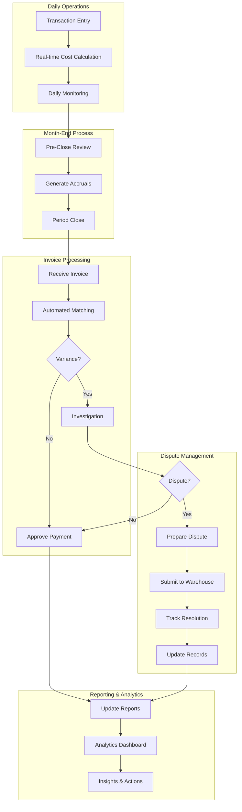

# Warehouse Billing Workflow - Visual Guide

## High-Level Process Flow



## Detailed User Journey Maps

### Operations Team Journey

```
┌─────────────────┐     ┌─────────────────┐     ┌─────────────────┐
│   Receive       │     │    System       │     │    Review       │
│   Shipment      │────▶│   Calculates    │────▶│    Costs        │
│                 │     │    Costs        │     │                 │
└─────────────────┘     └─────────────────┘     └─────────────────┘
         │                       │                       │
         ▼                       ▼                       ▼
┌─────────────────┐     ┌─────────────────┐     ┌─────────────────┐
│   Scan Items    │     │  Display Rate   │     │   Confirm if    │
│   /Enter Data   │     │   Breakdown     │     │   Over Limit    │
└─────────────────┘     └─────────────────┘     └─────────────────┘
```

### Finance Team Journey

```
┌─────────────────┐     ┌─────────────────┐     ┌─────────────────┐
│  Month Start    │     │   Daily Cost    │     │   Week-End      │
│  Setup Rates    │────▶│   Monitoring    │────▶│   Review        │
└─────────────────┘     └─────────────────┘     └─────────────────┘
         │                       │                       │
         ▼                       ▼                       ▼
┌─────────────────┐     ┌─────────────────┐     ┌─────────────────┐
│  Month-End      │     │    Receive      │     │   Reconcile     │
│  Accruals       │────▶│    Invoice      │────▶│   & Resolve     │
└─────────────────┘     └─────────────────┘     └─────────────────┘
```

## System Component Architecture

```
┌────────────────────────────────────────────────────────────────┐
│                        User Interface Layer                     │
├────────────────┬────────────────┬─────────────────────────────┤
│   Operations   │    Finance      │      Management             │
│   Dashboard    │    Portal       │      Analytics              │
└────────────────┴────────────────┴─────────────────────────────┘
                              │
┌────────────────────────────────────────────────────────────────┐
│                      Application Layer                          │
├─────────────┬──────────────┬──────────────┬───────────────────┤
│    Cost     │ Reconciliation│   Dispute    │    Reporting     │
│  Calculator │    Engine     │  Management  │    Platform      │
└─────────────┴──────────────┴──────────────┴───────────────────┘
                              │
┌────────────────────────────────────────────────────────────────┐
│                         Data Layer                              │
├─────────────┬──────────────┬──────────────┬───────────────────┤
│ Transaction │     Rate     │   Invoice    │    Analytics     │
│  Database   │  Repository  │   Storage    │   Data Mart      │
└─────────────┴──────────────┴──────────────┴───────────────────┘
```

## Key UI/UX Improvements by Role

### Operations Team
- **Mobile-First Design**: Large buttons, easy scanning
- **Real-Time Feedback**: Instant cost calculations
- **Visual Alerts**: Color-coded warnings for high costs
- **Offline Capability**: Queue transactions when disconnected

### Finance Team  
- **Dashboard Overview**: At-a-glance monthly status
- **Drill-Down Navigation**: From summary to detail
- **Bulk Operations**: Process multiple items efficiently
- **Smart Notifications**: Alert on exceptions only

### Management Team
- **Executive Summary**: KPI dashboard
- **Trend Analysis**: Visual charts and graphs
- **Predictive Insights**: AI-powered recommendations
- **Mobile Reports**: Access anywhere, anytime

## Critical Success Factors

```
┌─────────────────────┐
│   Automation First  │
│  ├─ 80% auto-match  │
│  ├─ Smart routing   │
│  └─ ML predictions  │
└─────────────────────┘
           │
           ▼
┌─────────────────────┐
│  Exception Focus    │
│  ├─ Clear alerts    │
│  ├─ Root cause     │
│  └─ Quick resolve   │
└─────────────────────┘
           │
           ▼
┌─────────────────────┐
│  Continuous Learn   │
│  ├─ Pattern detect  │
│  ├─ Process improve │
│  └─ Cost optimize   │
└─────────────────────┘
```

## Implementation Timeline

```
Q1: Foundation
├─ Rate Management System
├─ Cost Calculator
└─ Basic Reconciliation

Q2: Automation
├─ Invoice Matching
├─ Dispute Workflow
└─ Mobile Apps

Q3: Intelligence
├─ Predictive Analytics
├─ ML Algorithms
└─ Advanced Reports

Q4: Optimization
├─ Full Automation
├─ AI Insights
└─ Complete Integration
```