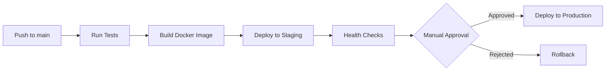

# Git Workflow for Shipping Builds to Production

This guide explains the standard Git workflow for deploying the WMS application from development to production, including branch strategies, CI/CD integration, and best practices.

## Table of Contents

1. [Branch Strategies](#branch-strategies)
2. [Development to Production Process](#development-to-production-process)
3. [Pull Request Workflow](#pull-request-workflow)
4. [Tagging Releases](#tagging-releases)
5. [CI/CD Integration](#cicd-integration)
6. [Best Practices](#best-practices)
7. [Rollback Strategies](#rollback-strategies)
8. [WMS-Specific Implementation](#wms-specific-implementation)

## Branch Strategies

### Git Flow vs GitHub Flow

#### GitHub Flow (Recommended for WMS)
A simplified workflow perfect for continuous deployment:

```
main (production-ready) ← feature/bugfix branches
```

**Advantages:**
- Simple and lightweight
- Supports continuous deployment
- Everything in main is deployable
- Short-lived feature branches

**Process:**
1. Create feature branch from main
2. Make changes and commit
3. Open pull request
4. Review and test
5. Merge to main
6. Deploy automatically

#### Git Flow
More complex workflow for scheduled releases:

```
main (production) ← release ← develop ← feature branches
         ↑                         ↑
         └── hotfix branches ──────┘
```

**When to use:**
- Scheduled release cycles
- Multiple versions in production
- Strict separation between development and production

### WMS Current Strategy

Based on the CI/CD configuration, WMS uses a **modified GitHub Flow**:

```
main (auto-deploy to staging → manual to production)
  ↑
  ├── feature/* (new features)
  ├── bugfix/* (bug fixes)
  ├── hotfix/* (urgent production fixes)
  ├── release/* (release preparation)
  └── chore/* (maintenance tasks)
```

## Development to Production Process

### 1. Local Development

```bash
# Start from latest main
git checkout main
git pull origin main

# Create feature branch
git checkout -b feature/inventory-optimization

# Make changes
# ... edit files ...

# Commit with conventional commits
git add .
git commit -m "feat: optimize inventory calculation algorithm"

# Push to remote
git push -u origin feature/inventory-optimization
```

### 2. Pull Request Creation

```bash
# Open PR via GitHub CLI
gh pr create --title "feat: optimize inventory calculation algorithm" \
  --body "## Summary
- Improved performance by 40%
- Reduced memory usage
- Added caching layer

## Test Plan
- [x] Unit tests pass
- [x] Integration tests pass
- [x] Manual testing completed"
```

### 3. Automated Checks (PR)

The following checks run automatically on PRs:

- **Code Quality**: ESLint, TypeScript checks
- **Tests**: Unit and integration tests
- **Coverage**: Minimum 40% coverage required
- **PR Title**: Must follow conventional commits
- **Branch Name**: Must match pattern
- **File Size**: No files >1MB
- **Dependency Review**: Security vulnerabilities

### 4. Review and Merge

```bash
# After approval and checks pass
# PR is merged via GitHub UI with squash merge
```

### 5. Automatic Deployment Pipeline



## Pull Request Workflow

### Creating a PR

1. **Naming Convention**:
   ```
   feat: add inventory tracking
   fix: resolve calculation error
   docs: update API documentation
   chore: update dependencies
   ```

2. **PR Template**:
   ```markdown
   ## Description
   Brief description of changes

   ## Type of Change
   - [ ] Bug fix
   - [ ] New feature
   - [ ] Breaking change
   - [ ] Documentation update

   ## Testing
   - [ ] Unit tests pass
   - [ ] Integration tests pass
   - [ ] Manual testing completed

   ## Checklist
   - [ ] Code follows style guidelines
   - [ ] Self-review completed
   - [ ] Comments added for complex logic
   - [ ] Documentation updated
   ```

### Review Process

1. **Automated Checks**: Must pass all CI checks
2. **Code Review**: At least 1 approval required
3. **Testing**: Reviewer should test locally if needed
4. **Merge Strategy**: Squash and merge to keep history clean

## Tagging Releases

### Semantic Versioning

WMS follows semantic versioning (MAJOR.MINOR.PATCH):

```bash
# Create release tag
git tag -a v1.2.0 -m "Release version 1.2.0"

# Push tag
git push origin v1.2.0
```

### Release Types

- **Major (v2.0.0)**: Breaking changes
- **Minor (v1.2.0)**: New features, backward compatible
- **Patch (v1.1.1)**: Bug fixes
- **Pre-release (v1.2.0-rc.1)**: Release candidates

### Automated Release Process

When a tag is pushed:

1. Tests run against tagged commit
2. Docker image is built and tagged
3. GitHub Release is created with changelog
4. Deployment to staging (automatic)
5. Deployment to production (manual approval)

## CI/CD Integration

### WMS CI/CD Architecture

```yaml
Workflows:
├── ci.yml                 # Basic CI checks
├── pr-checks.yml         # PR validation
├── test-suite.yml        # Comprehensive tests
├── deploy.yml            # Main deployment
├── deploy-ecs.yml        # AWS ECS deployment
├── release.yml           # Release automation
└── code-quality.yml      # Code standards
```

### Deployment Environments

1. **Development** (local)
   - Branch: feature/*
   - Database: Local PostgreSQL
   - No automation

2. **Staging**
   - Branch: main
   - Trigger: Push to main
   - Automatic deployment
   - Environment: AWS ECS (staging cluster)

3. **Production**
   - Branch: main (tagged releases)
   - Trigger: Manual approval
   - Environment: AWS ECS (production cluster)
   - Requires: All tests passing

### Environment Variables

Managed through GitHub Secrets:
- `STAGING_DATABASE_URL`
- `PRODUCTION_DATABASE_URL`
- `STAGING_NEXTAUTH_SECRET`
- `PRODUCTION_NEXTAUTH_SECRET`
- `AWS_ACCESS_KEY_ID`
- `AWS_SECRET_ACCESS_KEY`

## Best Practices

### 1. Commit Guidelines

```bash
# Good commits
git commit -m "feat: add SKU batch tracking"
git commit -m "fix: correct inventory calculation for returns"
git commit -m "docs: update deployment guide"

# Bad commits
git commit -m "fixed stuff"
git commit -m "WIP"
git commit -m "update"
```

### 2. Branch Management

```bash
# Keep branches up to date
git checkout feature/my-feature
git rebase main

# Clean up old branches
git branch -d feature/completed-feature
git push origin --delete feature/completed-feature
```

### 3. Testing Before Deploy

```bash
# Run full test suite locally
npm run test:all

# Check for type errors
npm run typecheck

# Lint code
npm run lint

# Build production bundle
npm run build
```

### 4. Database Migrations

```bash
# Always test migrations
npx prisma migrate dev

# Generate migration SQL for review
npx prisma migrate dev --create-only

# Apply in production
npx prisma migrate deploy
```

### 5. Security Practices

- Never commit secrets
- Use environment variables
- Rotate credentials regularly
- Review dependencies for vulnerabilities
- Keep Docker base images updated

## Rollback Strategies

### 1. Quick Rollback (Recommended)

Using AWS ECS previous task definition:

```bash
# Get previous task definition
aws ecs describe-task-definition \
  --task-definition wms-task-prod \
  --query 'taskDefinition.revision'

# Update service with previous version
aws ecs update-service \
  --cluster wms-cluster \
  --service wms-service-prod \
  --task-definition wms-task-prod:PREVIOUS_REVISION
```

### 2. Git Revert

For code rollback:

```bash
# Revert merge commit
git revert -m 1 <merge-commit-hash>
git push origin main

# This triggers new deployment with reverted code
```

### 3. Database Rollback

```bash
# Create down migration
npx prisma migrate diff \
  --from-schema-datamodel prisma/schema.prisma \
  --to-schema-datasource prisma/schema.prisma \
  --script > rollback.sql

# Apply carefully
psql $DATABASE_URL < rollback.sql
```

### 4. Feature Flags

Implement feature flags for gradual rollout:

```typescript
if (featureFlags.newInventorySystem) {
  // New implementation
} else {
  // Old implementation
}
```

## WMS-Specific Implementation

### Current Deployment Flow

1. **Development**
   ```bash
   git checkout -b feature/new-feature
   # Make changes
   git commit -m "feat: implement new feature"
   git push origin feature/new-feature
   ```

2. **Pull Request**
   - Automatic PR checks run
   - Code review required
   - All tests must pass

3. **Merge to Main**
   - Squash merge via GitHub UI
   - Triggers staging deployment

4. **Staging Deployment** (Automatic)
   - Builds Docker image
   - Pushes to ECR
   - Updates ECS service
   - Runs health checks

5. **Production Release**
   ```bash
   # Create release tag
   git tag -a v1.2.0 -m "Release v1.2.0"
   git push origin v1.2.0
   ```

6. **Production Deployment** (Manual)
   - Requires approval in GitHub Actions
   - Uses same Docker image from staging
   - Blue-green deployment in ECS
   - Automatic rollback on health check failure

### Monitoring Deployment

```bash
# Check deployment status
gh run list --workflow=deploy.yml

# View logs
gh run view <run-id> --log

# Monitor ECS service
aws ecs describe-services \
  --cluster wms-cluster \
  --services wms-service-prod

# Check application health
curl https://your-production-url/api/health
```

### Emergency Procedures

1. **Production Incident**
   ```bash
   # Create hotfix branch
   git checkout -b hotfix/critical-bug main
   
   # Fix issue
   git commit -m "fix: resolve critical production bug"
   
   # Fast-track to production
   git push origin hotfix/critical-bug
   # Create PR and merge immediately after tests pass
   ```

2. **Database Emergency**
   ```bash
   # Connect to production DB
   psql $PRODUCTION_DATABASE_URL
   
   # Create backup
   pg_dump $PRODUCTION_DATABASE_URL > backup-$(date +%Y%m%d).sql
   
   # Apply emergency fix
   # ... SQL commands ...
   ```

3. **Rollback Checklist**
   - [ ] Identify issue severity
   - [ ] Notify team via Slack
   - [ ] Create incident ticket
   - [ ] Execute rollback procedure
   - [ ] Verify system stability
   - [ ] Post-mortem analysis

## Conclusion

This Git workflow ensures reliable, tested deployments from development to production. The combination of automated testing, staging environments, and manual production approvals provides both agility and safety for the WMS application.

Key takeaways:
- Use feature branches for all changes
- Automated testing on every PR
- Staging deployment on merge to main
- Tagged releases for production
- Multiple rollback strategies available
- Clear emergency procedures

For questions or improvements to this workflow, please create an issue or contact the DevOps team.